# Enchère Hollandaise

|   Nom   | Prénom |
|---------|--------|
|   TEKFA   |  Fouad  |

Le TP est à réaliser individuellement.

## Présentation

Le projet consiste à créer un Smart Contract (SC) permettant de réaliser une enchère ascendante Hollandaise.

Une enchère ascendante hollandaise est un document électronique (RFx) [2] qui contient une liste d'articles que des acheteurs veulent vendre. Lors de cette enchère, le prix des articles diminue après des intervalles fixés jusqu'à ce que le prix réservé soit atteint. Avant que le prix réservé soit atteint, si le fournisseur fait une offre pour l'article, celui-ci est attribué à ce fournisseur et l'enchère est clôturée pour l'article.

Dans cette enchère, l'acheteur indique un prix de départ, une valeur de modification de prix, un intervalle de temps entre les modifications de prix et le prix réservé.

L'enchère s'ouvre avec le premier article avec le prix de départ spécifié et diminue selon la valeur de modification de prix (montant ou pourcentage) après un intervalle fixé. Le prix de départ diminue jusqu'à ce qu'un fournisseur fasse une offre ou que le prix de départ atteigne le prix réservé. Une fois l'enchère close pour l'article, l'enchère passe à un autre article de manière séquentielle.

L'enchère est clôturée lorsque la soumission d'offres pour tous les articles est terminée.

[1] : IBM. Enchère ascendante Hollandaise. [en ligne] Disponible sur *https://www.ibm.com/docs/fr/emptoris-sourcing/10.1.0?topic=rt-dutch-forward-auction* (Consulté le 12/2023).

[2] : IBM. Types de RFx. [en ligne] Disponible sur *https://www.ibm.com/docs/fr/emptoris-sourcing/10.1.0?topic=rfx-types* (Consulté le 12/2023).

## Restitution

**Un rapport concernant l'installation des outils de développement Ethereum doit être rédigé avant la fin du premier TP.**

### Installation des Outils de Développement : 
#### 1- Installation NodeJS LTS :
Si vous n'avez pas encore installé NodeJS, voici les commandes à suivre pour l'installer sur un système basé sur Debian ou Ubuntu :
dans mon coter j'ai deja installer Node js 
```shell
sudo apt update
sudo apt install nodejs npm
```
De mon côté, j'ai déjà installé NodeJS. Pour vérifier que NodeJS est correctement installé et connaître la version installée, vous pouvez exécuter la commande suivante dans votre terminal :

  ```shell
   node --version 
   ```
   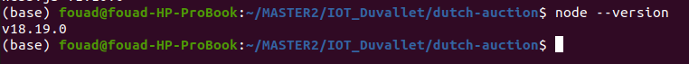

 Notez que l'utilisation de la commande sudo apt install installe la version de NodeJS disponible dans le dépôt de votre système, qui peut ne pas être la dernière version LTS. Pour des projets de développement Ethereum, il est souvent recommandé d'utiliser des outils de gestion de versions comme 'nvm' ou 'asdf' pour installer la version spécifique de NodeJS qui répond au mieux aux exigences de votre projet


### 2- Installation de Ganache

Ganache est une application de bureau qui simule une blockchain Ethereum personnelle pour le développement de Smart Contracts. Elle vous permet de déployer des contrats, de développer vos applications et d'exécuter des tests. Voici comment installer Ganache sur un système Ubuntu :

1. **Téléchargez Ganache :**  
   Rendez-vous sur le site officiel de Truffle Suite pour télécharger la dernière version de Ganache pour Linux : [Ganache](https://trufflesuite.com/ganache/).

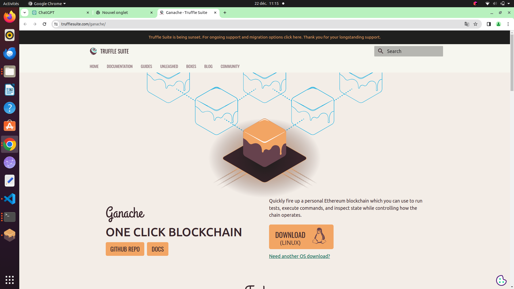

2. **Préparation du script d'installation :**  
   - Une fois le téléchargement terminé, vous trouverez un fichier appelé `ganache-<version>-x86_64.AppImage` dans votre dossier de téléchargements.
   - Ouvrez un terminal et naviguez vers le dossier où le fichier a été téléchargé.

   - Rendez le fichier téléchargé exécutable afin de pouvoir lancer Ganache. Remplacez <version> par la version que vous avez téléchargée et exécutez la commande :
   ```shell
   chmod 777 ganache-2.7.1-linux-x86_64.AppImage
   ```
   
3. **Lancement de Ganache :**  
   Après avoir rendu le fichier exécutable, vous pouvez lancer Ganache en utilisant la commande :

   ```shell
   ./ganache-<version>-x86_64.AppImage
   ```

   Une fenêtre Ganache devrait s'ouvrir, indiquant que vous avez maintenant une blockchain Ethereum locale en cours d'exécution.

   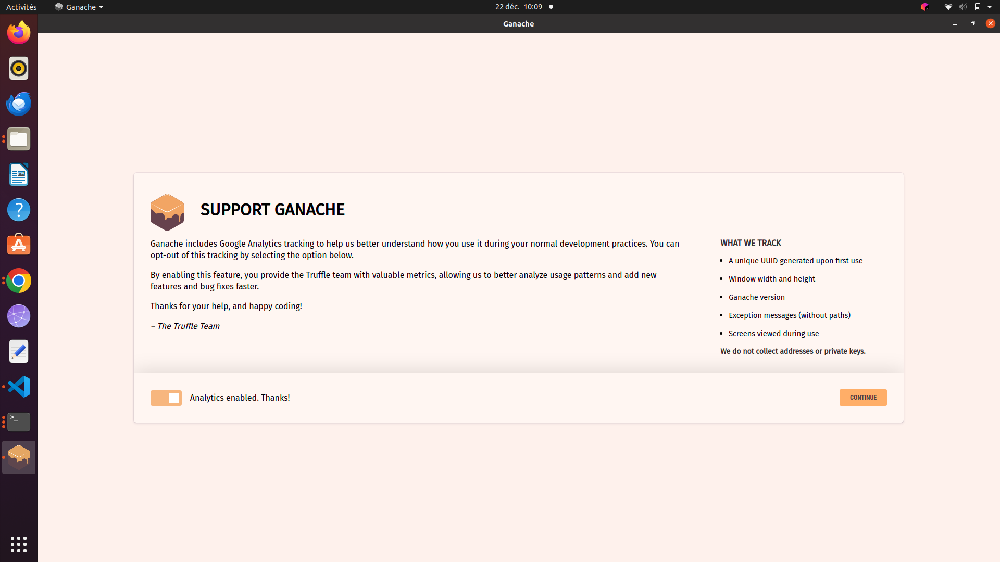
   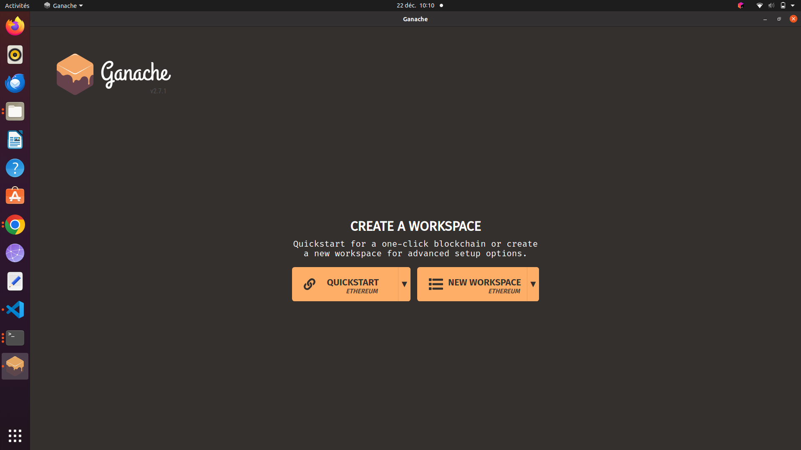

    vous pouvez choisir de créer un nouvel espace de travail (new workspace) pour commencer à développer et tester vos Smart Contracts.
    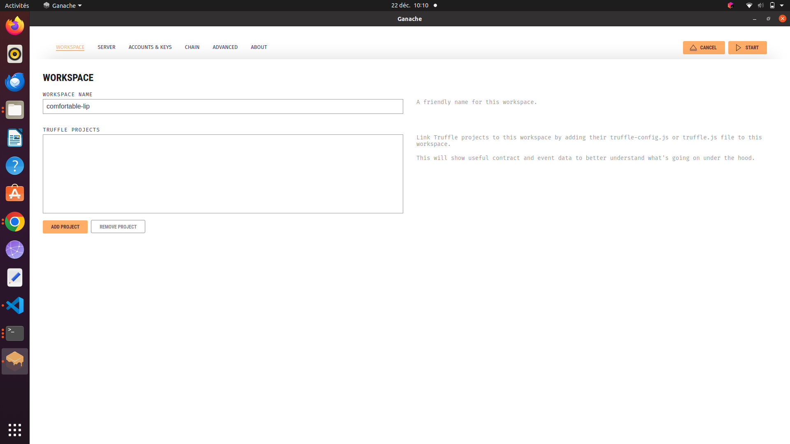


4. **Lancement de Ganache avec start :**
      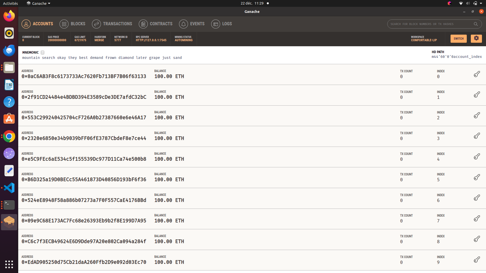


### Installation de Truffle

Truffle est un environnement de développement, un framework de test et un pipeline d'actifs pour les blockchains utilisant l'Ethereum Virtual Machine (EVM). C'est un outil indispensable pour le développement de Smart Contracts. Voici comment l'installer :


1. **Accédez à la documentation de Truffle :**  
   Consultez la documentation officielle pour obtenir des informations à jour et des conseils supplémentaires : [Documentation Truffle](https://trufflesuite.com/docs/truffle/how-to/install/).


2. **Installez Truffle :**  
   Ouvrez un terminal et utilisez npm pour installer Truffle globalement sur votre système :

   ```shell
   npm install -g truffle
   ```

   Pendant l'installation, il est possible que vous receviez une liste d'avertissements. Ces avertissements sont généralement bénins et liés à des dépendances ou à des mises à jour.

3. **Vérifiez l'installation :**  
   Pour confirmer que Truffle a été correctement installé, exécutez la commande suivante :

   ```shell
   truffle version
   ```
   
   Cette commande affiche la version de Truffle installée ainsi que les versions de dépendances associées comme Solidity, ce qui indique que Truffle est prêt à être utilisé.
    
    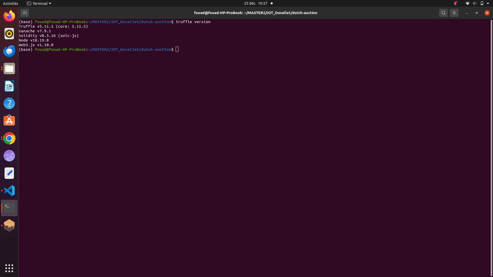


    Après avoir terminé les installations nécessaires, vous passerez à la création de votre projet Truffle avec MetaCoin,  Voici comment procéder, étape par étape :

1. **Création du projet avec MetaCoin :**  
   - Dans votre terminal, exécutez la commande suivante pour créer un nouveau projet Truffle utilisant le box MetaCoin :
     ```shell
     truffle unbox metacoin
     ```
   - Cette commande télécharge les fichiers nécessaires et prépare l'environnement de développement pour MetaCoin.
  
   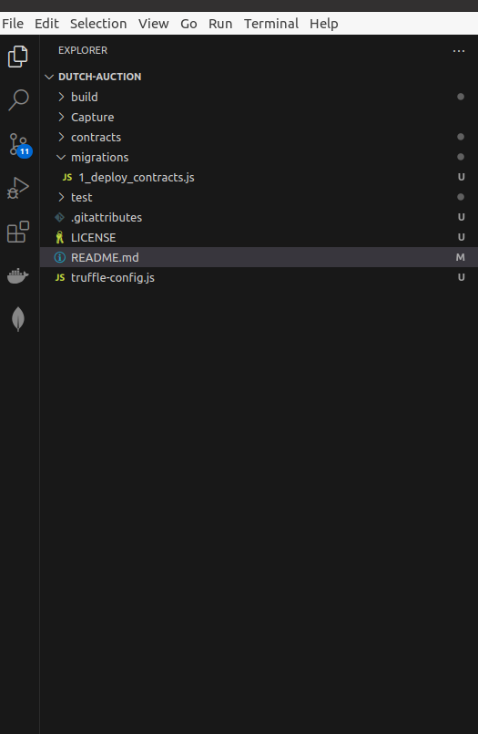

2. **Compilation du projet :**  
   - Compilez les contrats intelligents de votre projet avec la commande :
     ```shell
     truffle compile
     ```
   


3. **Migration du contrat :**  
   - Déployez les contrats sur la blockchain locale (Ganache, par exemple) en exécutant :
     ```shell
     truffle migrate
     ```
   - La migration s'occupe du déploiement des contrats sur votre réseau Ethereum spécifié dans le fichier de configuration Truffle.
    
    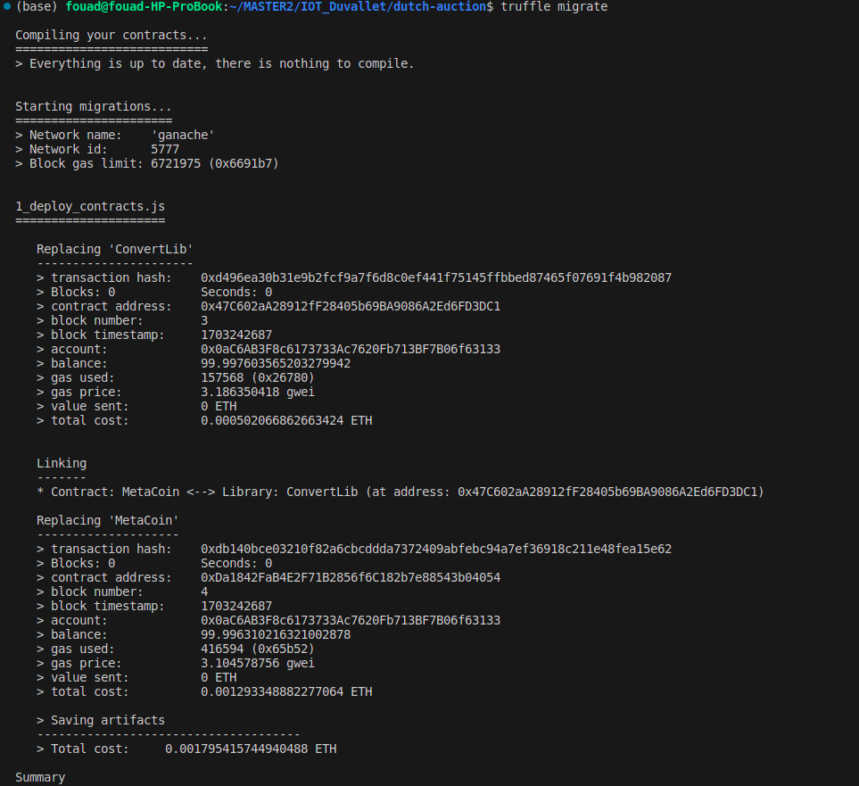


4. **Test du contrat :**  
   - Testez les contrats déployés avec la commande :
     ```shell
     truffle test
     ```
   - Truffle exécutera les scripts de test fournis dans le dossier 'test' de votre projet pour s'assurer que les contrats fonctionnent comme prévu.

   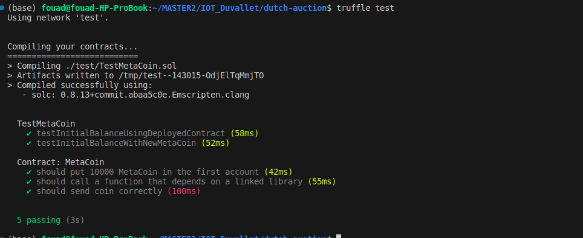


Pour ajouter l'extension MetaMask à votre navigateur et créer un compte, suivez ces étapes :


## Installation et Configuration de MetaMask

vous installerez l'extension MetaMask sur votre navigateur. 

### Création d'un compte MetaMask :

1. **Ouvrez MetaMask :**
   - Après l'installation, l'icône de MetaMask apparaîtra dans la barre d'outils de votre navigateur. Cliquez dessus pour l'ouvrir.

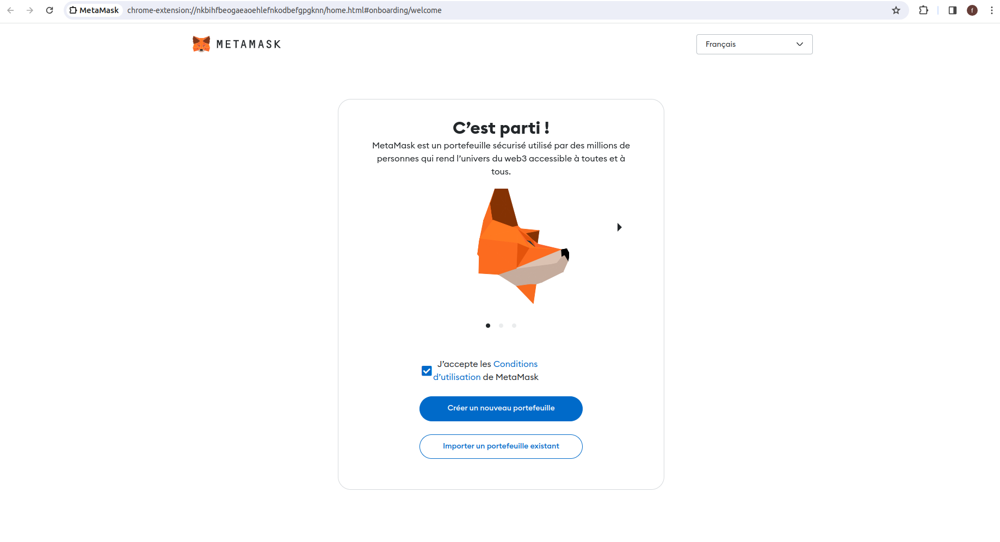


2. **Configurez votre nouveau portefeuille :**
   - Lors du premier lancement, MetaMask vous demandera si vous souhaitez créer un nouveau portefeuille ou importer un portefeuille existant. Sélectionnez "Créer un portefeuille".
   - Acceptez les conditions d'utilisation après les avoir lues attentivement.

3. **Créez un mot de passe fort :**
   - Choisissez un mot de passe sécurisé. Ce mot de passe sera utilisé pour accéder à MetaMask sur votre navigateur. Il ne récupérera pas votre portefeuille si vous oubliez votre phrase secrète.

4. **Sauvegardez votre phrase secrète :**
   - MetaMask vous fournira une phrase secrète de 12 mots. C'est la clé de votre portefeuille et nécessaire pour récupérer votre compte si vous oubliez votre mot de passe ou changez d'appareil. Écrivez-la et gardez-la dans un endroit sûr et sécurisé.

5. **Confirmez votre phrase secrète :**
   - Pour vous assurer que vous avez bien sauvegardé votre phrase secrète, MetaMask vous demandera de la saisir à nouveau. Suivez les instructions pour terminer la configuration.

6. **Votre portefeuille est prêt :**
   - Une fois que tout est configuré, vous accéderez à l'interface utilisateur de MetaMask, où vous pourrez gérer vos fonds, connecter votre portefeuille à des applications décentralisées, et bien plus encore.
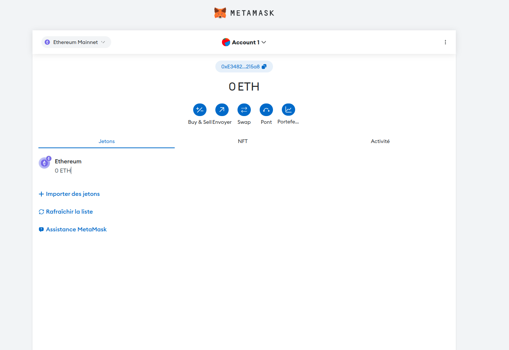


### Configuration du Réseau avec MetaMask

Pour établir la connexion entre MetaMask et Ganache :

1. **Ajouter un réseau** : Sélectionnez "Ajouter un réseau" puis choisissez "Ajouter un réseau manuellement".

2. **Saisir les informations** :

   

3. **Confirmation de l'ajout** : Après avoir cliqué sur "Enregistrer", une fenêtre confirmera que le réseau a été ajouté avec succès.
 
 


## Importation d'un Compte

1. **Choisir l'importation** : Dans MetaMask, sélectionnez "Importer un compte".

2. **Entrer la clé privée** : Utilisez celle d'une adresse Ganache.
   

3. **Confirmer** : Vous devriez maintenant voir votre adresse et le solde correspondant dans MetaMask.
   


## Vérification du Déploiement

Avant de vérifier le déploiement, assurez-vous que la configuration de votre réseau local est correctement définie dans le fichier `truffle-config.js`. La section pertinente doit être décommentée comme suit :

```shell
development: {
  host: "127.0.0.1",     // Localhost (par défaut : aucune)
  port: 7545,            // Port Ethereum standard (par défaut : aucun)
  network_id: "*",       // Tout réseau (par défaut : aucun)
},
```

Ensuite, procédez aux commandes suivantes pour compiler vos contrats et les déployer sur le réseau spécifié :

1. Compilez les contrats :
   ```shell
   truffle compile
   ```

2. Déployez les contrats sur le réseau :
   ```shell
   truffle migrate
   ```

Ensuite, dans Ganache, ajoutez le chemin vers votre `truffle-config.js`. Sélectionnez 'Add Project' et redémarrez Ganache pour appliquer les modifications.

 

**Confirmer la connexion avec Ganache** :

 Dans l'onglet "Contrats" de Ganache, recherchez le statut "deployed" pour confirmer le déploiement réussi.
   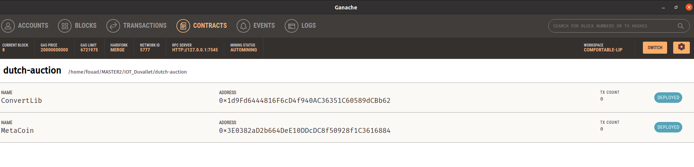

Le rendu du projet est prévu avant le début du second TP. Il est nécessaire de tester le SC, il est donc demandé de rédiger des tests unitaires ainsi que de la documentation à propos du SC.

## Installation

Installez [NodeJS LTS](https://nodejs.org) (via `nvm` ou `asdf`), [Ganache](https://trufflesuite.com/docs/ganache/), [Truffle](https://trufflesuite.com/docs/truffle/) ainsi que MetaMask. N'oubliez pas de rédiger votre rapport en même temps.

